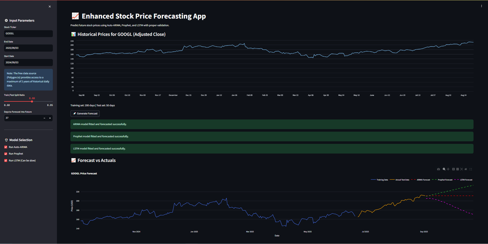

# 📈 Dynamic Stock Price Forecasting App

An interactive **time series forecasting web application** built with **Streamlit**, deployed on **Render**, and powered by three models:

- **Auto-ARIMA** (`pmdarima`)
- **Prophet** (`prophet`)
- **LSTM** (TensorFlow/Keras)

Users input a stock ticker, fetch historical **adjusted close** data from **Polygon.io**, and generate multi-day forecasts with side-by-side comparisons and RMSE metrics.

> **Live App:** [https://times-series-analysis.onrender.com/](https://times-series-analysis.onrender.com/)

---

## ✨ Features

- 🔌 Fetches split-adjusted daily prices via **Polygon.io**
- ⚙️ Custom **train/test split** and **forecast horizon**
- 🤖 Toggle **ARIMA / Prophet / LSTM** independently
- 📈 Interactive Plotly chart (actuals vs. forecasts)
- 📉 **RMSE** evaluation table for test period
- 🚀 One-click deploy on **Render**

---

## 🖼️ Preview



*(If you don’t see an image, make sure `assets/screenshot.png` exists in your repo.)*

---

## 🧱 Tech Stack

- **Frontend / Hosting:** Streamlit + Render  
- **Data Source:** Polygon.io REST API  
- **Models:** pmdarima (Auto-ARIMA), Prophet, TensorFlow/Keras (LSTM)  
- **Viz:** Plotly  
- **Utils:** NumPy, Pandas, scikit-learn  

---

## 📦 Local Setup

### 1) Clone
```bash
git clone https://github.com/sushanth-kumar-prog/Times-series-analysis.git
cd Times-series-analysis
